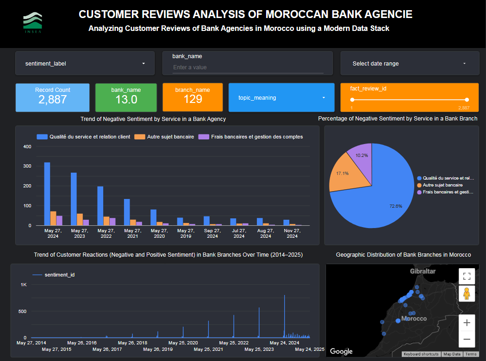

# Analyzing Customer Reviews of Bank Agencies in Morocco using a Modern Data Stack

## Project Overview

This project leverages Google Maps reviews to analyze customer feedback across Moroccan bank agencies using a modern data pipeline. Unstructured textual reviews are transformed into actionable insights through NLP techniques, including sentiment analysis and topic modeling. The project was developed as part of the Master’s program in Information Systems and Intelligent Systems.

---

## Objectives

- Automate collection of customer reviews from Google Maps.
- Apply sentiment analysis to assess customer satisfaction.
- Use topic modeling to extract recurring themes (e.g., staff behavior, ATM issues).
- Rank bank branches by performance using sentiment metrics.
- Visualize insights through interactive dashboards.

---

## Technology Stack

| Stage                 | Technology Used                          |
|----------------------|-------------------------------------------|
| Data Collection      | Python, Selenium, BeautifulSoup   |
| Orchestration        | Apache Airflow                           |
| Data Storage         | PostgreSQL (hosted on Aiven)             |
| Transformation       | DBT (Data Build Tool)                    |
| Visualization        | Looker Studio                            |
| Version Control      | Git + GitHub                             |

---




## Project Structure

```plaintext
├── dags/                     # Airflow DAGs for scheduling ETL the main dag is S_G_M_R.py
├── dbt_project/              # DBT models and transformations
├── data/                     # Raw and processed datasets
├── rapport/                  # Project rapport
├── reports/                  # PDF reports and presentation material
└── README.md                 # Project overview

